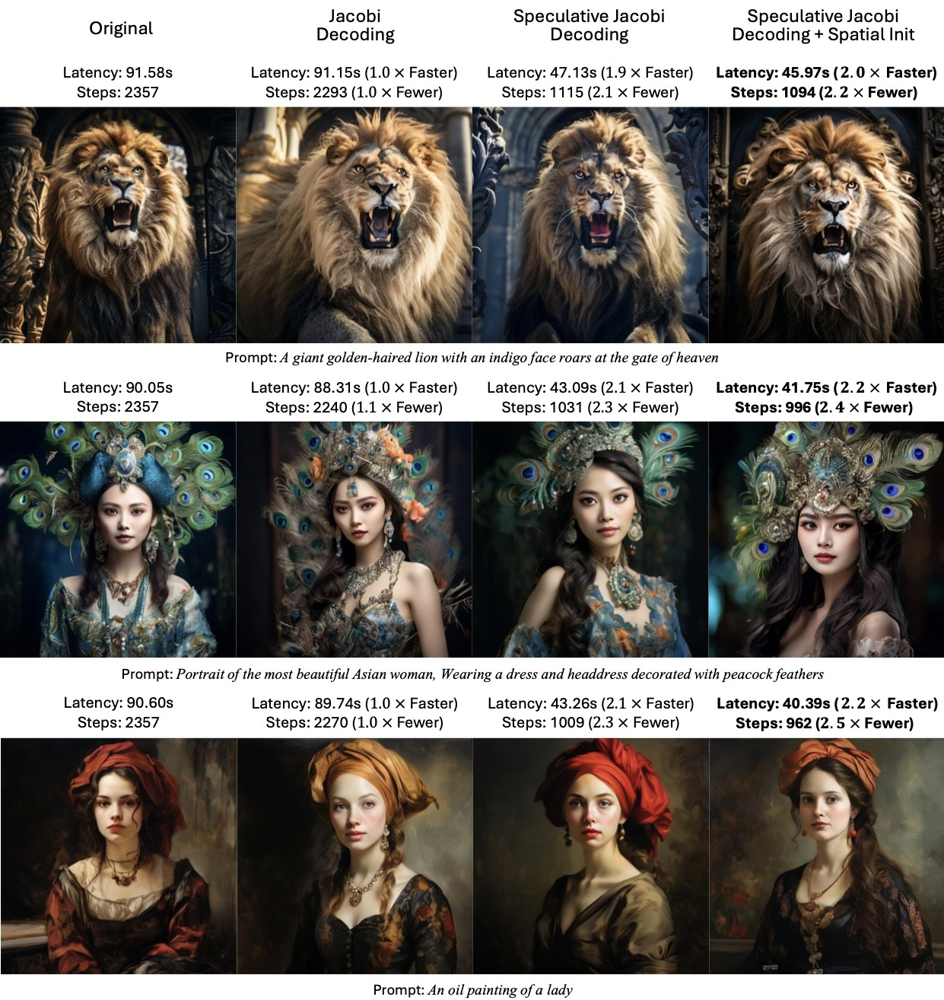

# <font color=#0000F0>SJD</font>: Accelerating Auto-regressive Text-to-Image Generation with Training-free <br><font color=#0000F0>S</font>peculative <font color=#0000F0>J</font>acobi <font color=#0000F0>D</font>ecoding

[Yao Teng](https://tyshiwo1.github.io/)<sup>1</sup>, [Han Shi](https://han-shi.github.io/)<sup>2</sup>, [Xian Liu](https://alvinliu0.github.io/)<sup>3</sup>, [Xuefei Ning](https://nics-effalg.com/ningxuefei/)<sup>4</sup>, [Guohao Dai](https://dai.sjtu.edu.cn/)<sup>5,6</sup>, [Yu Wang](https://scholar.google.com.hk/citations?user=j8JGVvoAAAAJ)<sup>4</sup>, [Zhenguo Li](https://zhenguol.github.io/)<sup>2</sup>, and [Xihui Liu](https://xh-liu.github.io/)<sup>1</sup>.

*<sup>1</sup>The University of Hong Kong, <sup>2</sup>Huawei Noah’s Ark Lab, <sup>3</sup>CUHK, <sup>4</sup>Tsinghua University, <sup>5</sup>Shanghai Jiao Tong University, <sup>6</sup>Infinigence AI*

<a href='https://arxiv.org/abs/2410.01699'></a>  <a href=''></a>

## 🚩 New Features/Updates

- ✅ Jan, 2025. 💥 **<font color=#0000F0>SJD</font>** is accepted to ICLR 2025.
- ✅ Oct, 2024. Release **<font color=#0000F0>SJD</font>**'s code.

## Installing the dependencies

##### Environment: 

- Python 3.10
- CUDA 12.5
- Pytorch 2.5.1+cu124
- Transformers 4.47.1

##### Install from `yaml`:

```bash
conda env create -f environment.yaml
```

## Performance

- Results on [Emu3](https://github.com/baaivision/Emu3) 
  

- Results on [Lumina-mGPT](https://github.com/Alpha-VLLM/Lumina-mGPT) 
  

## Text-to-Image with <font color=#0000F0>SJD</font>

#### Lumina-mGPT

```bash
CUDA_VISIBLE_DEVICES=0 python test_lumina_mgpt.py
```

#### Emu3

```bash
CUDA_VISIBLE_DEVICES=0 python test_emu3.py
```

#### LlamaGen

```bash
CUDA_VISIBLE_DEVICES=0 python test_llamagen.py
```

## Acknowledge

Our code is based on [Lumina-mGPT](https://github.com/Alpha-VLLM/Lumina-mGPT), [Emu3](https://github.com/Alpha-VLLM/Lumina-mGPT), [LlamaGen](https://github.com/FoundationVision/LlamaGen), and [Anole](https://github.com/GAIR-NLP/anole). We would like to express our gratitude to [Tianwei Xiong](https://github.com/SilentView) for his assistance.

## Citation

```bibtex
@article{teng2024accelerating,
  title={Accelerating auto-regressive text-to-image generation with training-free speculative jacobi decoding},
  author={Teng, Yao and Shi, Han and Liu, Xian and Ning, Xuefei and Dai, Guohao and Wang, Yu and Li, Zhenguo and Liu, Xihui},
  journal={arXiv preprint arXiv:2410.01699},
  year={2024}
}
```

